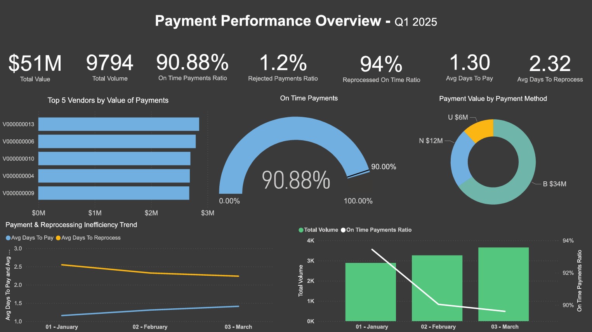
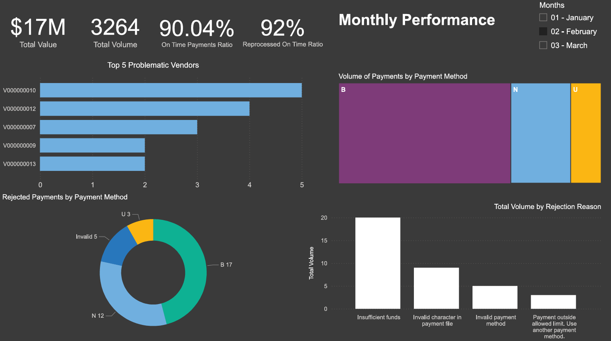

# Accounts Payable KPIs Dashboard – Q1 2025 Overview

This Power BI dashboard provides a comprehensive overview of **Accounts Payable (AP) performance** for Q1 2025, focusing on key operational metrics such as **payment efficiency**, **on-time performance**, and **rejection trends**.  
It enables finance teams and management to monitor supplier payment health, assess process bottlenecks, and ensure timely settlement of obligations.

---

## 📈 Dashboard Pages

### 🧾 Page 1 – Q1 2025 Payments Overview

**Highlights:**
- KPIs summarizing **Total Payments**, **Average Days to Pay**, and **On-Time Payment Ratio**.  
- Quick view of overall supplier payment trends and performance targets.  
- Card visuals and comparison indicators for fast insight into quarter-level results.

---

### 📅 Page 2 – Monthly Performance Dashboard

**Highlights:**
- Monthly trend analysis of payments processed.  
- **Interactive slicer** allowing users to filter by specific months.  
- Breakdown of **Rejected** and **Reprocessed** payments over time.  
- Visual correlation between on-time payment rates and overall volume.

💡 *Tip:* Click on either image in GitHub to open the full-resolution dashboard page.

---

## 🎯 Business Objective

To provide a **data-driven perspective** on the efficiency and reliability of the Accounts Payable process for Q1 2025.  
The dashboard helps:
- Identify delays or inefficiencies in payment processing.  
- Track compliance with on-time payment targets.  
- Highlight recurring issues, such as rejection causes 

---

## 📊 Key KPIs

| KPI | Description |
|-----|--------------|
| **Total Volume** | Total number of processed AP transactions |
| **Avg Days to Pay** | Average time taken to process and clear payments |
| **On-Time Payments Ratio** | Share of payments completed on or before SLA date (1 business day after invoice entry, target 90%) |
| **Rejected Payments Ratio** | Percentage of payments rejected due to errors (target 1%) |
| **Reprocessed On-Time Ratio** | Proportion of reprocessed payments completed on time (3 business days, target 95% |

---

## ⚙️ Tools and Technologies

- **Microsoft Power BI** – Data modeling, visualization, and report design  
- **Excel / CSV** – Data preparation and import  
- **DAX** – Custom measures for KPIs   
- **GitHub** – Version control and portfolio sharing  

---

## 🧠 Summary & Insights

- **On-Time Payments** decreased consistently over the quarter, going below target in March. Recommendation: to explore process simplification, so processing times keep up with increasing volumes.   
- **Average Days to Pay** trended upward, reflecting efficiency drops.  
- **Rejected Payments** Overall performance above 1% in Q1, with insufficient funding the main contributor. Collaboration with Treasury is recommended, to discover root causes.   
- **Monthly analysis** highlights increasing utilization of RTGS (payment method U), same-day payments. It's recommended to analyse further, if those vendors could be paid using more cost-effective methods, B (book payments) or N (ACH).  

---

📅 *Created October 2025*  
👤 **Author:** Abdalla Osman   
📍 *Data Source:* Sample Accounts Payable CSV file generated by ChatGpt, using existing ERP (SAP) standard layout

